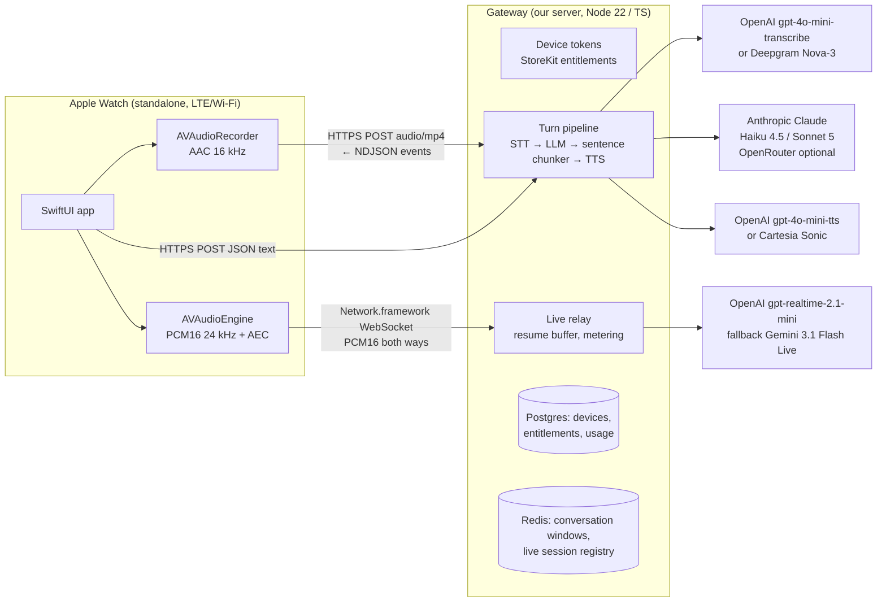

# WatchGPT: Product & Technical Spec (v0.1)

> Codename. **Do not ship the name "WatchGPT"**: Apple rejects "GPT" in app names (the original *watchGPT* was forced to rename to *Petey* in 2023, and Guideline 4.1(c) tightened this in Nov 2025). See `research/01`, `research/05`.

Status: design + working prototype (gateway server, browser reference client, watchOS client source). Last verified against the market and platform: **2026-09-24** (watchOS 27 current).

---

## 1. The bet

No frontier lab ships an Apple Watch app. That includes ChatGPT, Claude, Gemini, Perplexity and Grok (`research/01`). Siri AI in watchOS 27 depends on the iPhone and is reported to be slow in standalone mode. The incumbents are small indie apps, mostly OpenAI-only, with weak voice and billing complaints.

**WatchGPT is the frontier assistant for your wrist:** raise, talk, and hear a short answer in about 2 seconds, over LTE, with the phone at home.

### Goals (v1)
1. **Time-to-mic < 1 s** from any entry point (complication, Smart Stack, Action button, double tap).
2. **Time-to-first-audio < 2.5 s p50 on LTE** for push-to-talk turns.
3. Works **fully standalone** (Wi-Fi or cellular, iPhone off).
4. **No account creation.** The subscription is the account.
5. **One price, one tier.** Explained in one line on a 46 mm screen.

### Non-goals (v1)
- An iPhone companion app. Watch-only. Revisit once paywall data exists (`research/05`).
- Tools and actions (timers, messages, HomeKit). Siri owns these. We answer questions and draft text.
- Browsing history on the watch beyond the current thread.
- Using the user's existing ChatGPT or Claude subscription (not possible legitimately. See §8).

---

## 2. Experience

The visual spec is in `mockups/index.html` (published artifact). Summary:

| Flow | Screens | Transport |
|---|---|---|
| **Ask** (core) | Home mic, then Listening, then Transcribed, then Answer (spoken + captioned) | `POST /v1/turns`, NDJSON |
| **Type** (quiet places) | System dictation or Scribble `TextField`, sent with `reply=text` | same |
| **Live** (hands-free) | Orb listening/speaking, barge-in, mute, end summary with minutes left | `WSS /v1/live` |
| **Trust** | Consent (names OpenAI and Anthropic, per 5.1.2(i)), Paywall, Offline (queued) | — |
| **Entry** | Complication, Smart Stack widget, Control (Action button on Ultra, Control Center), double tap, App Shortcuts | deep links `watchgpt://listen`, `watchgpt://live` |

Voice rules, enforced by the server system prompt (`server/src/config.ts`):
- Lead with the answer, 1–3 sentences.
- No markdown or lists.
- Speakable numbers.
- Offer to continue instead of monologuing.

---

## 3. Architecture

### Why a gateway (and not calling providers from the watch)
- **Keys stay on the server.** Billing, quotas and abuse control live in one place.
- **One protocol for the watch.** Providers change monthly. The watch only sees `docs/API.md`.
- **Resume buffer.** watchOS drops sockets often (see §4). Only a server-side session can survive that.
- **Transcoding.** The server converts between the watch-friendly and provider formats.
- **Sentence chunking.** TTS starts after the first sentence, while the LLM is still streaming.

### Why two transports
From `research/02` (TN3135, still current as of July 2026):

| | Turn mode | Live mode |
|---|---|---|
| API | `URLSession` + `bytes(for:)` | **Network.framework** `NWConnection` + `NWProtocolWebSocket` |
| Allowed when | Always, incl. cellular | **Only while an audio session is active** (`await AVAudioSession.activate()`) |
| Platform risk | None | High: grant revoked ~36 s after activate (FB24377808). Workaround: re-activate every ~30 s + server resume |
| Ships in | **M1** | **M2**, behind device spike |

`URLSessionWebSocketTask` is denied on watchOS even with an audio session. No WebRTC SDK supports watchOS (LiveKit closed it as "wontfix").

---

## 4. Components

### 4.1 Gateway (`server/`, working prototype)
- `POST /v1/devices`: anonymous device account with an HMAC token. `GET /v1/me`.
- `POST /v1/turns`: audio or text in, streamed NDJSON out. The events are:
  - `turn.started`
  - `transcript`
  - `text.delta`
  - `audio.segment` (one full MP3 per sentence, synthesized in parallel, emitted in order)
  - `turn.completed`
- `GET /v1/live` (WS): relays PCM16 to a realtime S2S provider. It normalizes events, meters wall-clock seconds, enforces quota, and handles barge-in (`speech.started` tells the client to flush playback).
  - **Resume:** a session outlives its socket for 15 s. Output is buffered (≤ 10 s of audio), and `session.start{resume_session_id}` re-attaches.
- Provider adapters, each one file:
  - `providers/mock.ts`: offline and deterministic. The whole stack runs with no keys.
  - `providers/anthropic.ts`: official SDK, streaming. Thinking is off on Sonnet 5 for latency.
  - `providers/real.ts`: OpenRouter SSE LLM, OpenAI STT, TTS and Realtime WS.
- `POST /v1/entitlements/apple`: **stub**. Production must verify the StoreKit 2 JWS (App Store Server Library) and bind `originalTransactionId` to the device.
- Tests: `npm test` (11 end-to-end tests over real HTTP/WS with mock providers, including resume).

### 4.2 Browser reference client (`server/public/index.html`)
Served by the gateway at `/`. It speaks the exact protocol:
- MediaRecorder push-to-talk
- NDJSON reader and ordered audio-segment player
- Live mode over an AudioWorklet at 24 kHz, with barge-in flush
- A **"Simulate network drop"** button that exercises resume
- A latency panel (transcript, first text, first audio, complete)

The Swift client mirrors its logic.

### 4.3 watchOS client (`watchos/`, source prototype, not compiled here)
- SwiftUI, watch-only, watchOS 26+.
- `APIClient`: `URLSession.bytes` NDJSON.
- `Recorder`: AAC.
- `SegmentPlayer`: an `AVAudioPlayer` queue.
- `LiveSession`: NWConnection WS, AVAudioEngine with voice processing, 30 s re-activate, resume with backoff.
- `OfflineQueue`, StoreKit 2 `Store`, Consent/Paywall/Offline views.
- WidgetKit complication, Smart Stack and Control; App Intents.

See `watchos/README.md` for the **verify-on-device checklist** and the list of unverified APIs.

---

## 5. Inference stack & unit economics

Sources: `research/03`. Prices were seen 2026-09-24; re-verify on vendor pages.

| Leg | Choice | Why | Fallback |
|---|---|---|---|
| STT (turns) | `gpt-4o-mini-transcribe` ($0.003/min) | Accepts m4a directly, cheap, good | Deepgram Nova-3 (streaming while the upload arrives) |
| LLM | **Claude Haiku 4.5** (`fast`, default) / **Sonnet 5** (`smart`), **direct Anthropic API** | Best voice-sized answers, low TTFT. Direct avoids OpenRouter's 5.5% fee and its "no reselling / competing service" ToS clause | OpenRouter (`LLM_PROVIDER=openrouter`) for model breadth |
| TTS | `gpt-4o-mini-tts` (~$0.015/min, MP3/AAC/Opus output) | Cheapest, native compressed output, instructable voice | Cartesia Sonic (lowest TTFB, PCM, server encodes) |
| Live S2S | **`gpt-realtime-2.1-mini`**, server WebSocket | ~$0.02–0.03/min. PCM16 24 kHz matches our wire format | Gemini 3.1 Flash Live. Then cascaded Deepgram Flux → Claude → Cartesia (also "Claude voice") |

OpenRouter has no realtime/S2S endpoint, and Anthropic has no speech API. So the live path cannot go through either.

**Cost per user per month (from `research/03`):**

| User | Usage | Est. cost |
|---|---|---|
| Light | 10 turns/day, spoken replies | $1.5–5 |
| Typical Pro | 10 turns/day + 60 min Live/mo | ~$5–7 |
| Heavy Live (uncapped) | 20 min/day Live | $12–18 on mini, $42+ on the flagship |

**So Live minutes must be metered.** At $9.99/mo, Apple takes 15% (Small Business Program) and we net about $8.49. Margin is healthy only with a Live cap.

---

## 6. Pricing & accounts (`research/05`)

- **One tier: $9.99/month, 7-day free trial.**
  - Unlimited asks (fair use: 300/day).
  - **60 min Live per month.**
  - Enforced server-side: `config.limits`.
- **StoreKit 2 on the watch.** Watch web checkout is impractical (no Safari), so skip it despite the 2025 anti-steering ruling. Enroll in the Small Business Program (15%) on day one.
- **No login.** An anonymous device token, bound to the StoreKit `originalTransactionId` on purchase. A reinstall or new watch restores through that ID.
  - This sidesteps 4.8 (login parity) and 5.1.1(v) (in-app account deletion). Still offer "Delete my data" in settings.
- **Later:**
  - "Live+" at ~$24.99 (10 h/month).
  - "Connect OpenRouter" (OAuth PKCE), where users pay OpenRouter directly (`research/04`).

---

## 7. Privacy, safety & App Review
- **Guideline 5.1.2(i)** (Nov 2025): explicit consent, before any data is sent, that **names** the third-party AI providers. This is screen C1, and it's a hard gate before the mic opens.
- Retention: conversation text 30 days, then deleted. Audio is never stored after STT, except in the watch's offline queue. No training on user data (true for the API tiers we use; re-confirm per vendor).
- Age rating: self-rate 13+ or 16+ under the 2025 system, and answer the AI-content questionnaire honestly.
- Privacy label: Audio Data and User Content (linked to the device ID, not to identity). Diagnostics.
- Moderation: rely on provider safety plus a lightweight server-side moderation check on transcripts. 1.2 asks for reporting in UGC apps, but this isn't UGC. Still, offer "Report answer" by long-press.

---

## 8. Using existing ChatGPT or Claude subscriptions: verdict **no** (`research/04`)

| Option | Status |
|---|---|
| Anthropic (Claude Pro/Max OAuth) | **Explicitly prohibited** for third-party apps, and enforced since Jan–Apr 2026 |
| OpenAI (ChatGPT Plus) | "Sign in with ChatGPT" (Aug 2026 beta) is **identity only, no billing**. Reusing the Codex OAuth login is unsanctioned and has led to bans. "ChatPass" subscription sharing exists only in unreleased code. **Re-check quarterly** |
| Google (Gemini) | No program. Accounts have been banned for routing logins through third-party tools |
| **OpenRouter OAuth PKCE** | ✅ Legit. The user pays OpenRouter directly. A good "BYO" tier later |
| **Apple PCC model on watchOS 27** | ✅ Free to us under 2M downloads, and higher limits for iCloud+ users. It's Apple's model, not GPT or Claude. Candidate **free tier / offline-ish fallback** (verify on device) |

Building on unofficial subscription tokens risks users' $20–200/month accounts, App Review (5.2.2), and overnight breakage. Don't.

---

## 9. Risks (ranked)

| # | Risk | Likelihood | Mitigation |
|---|---|---|---|
| 1 | Live-mode network grant revoked (~36 s), or the workaround breaks in a watchOS update | High | Ship turn mode first. Live uses 30 s re-activate + server resume. Fallback: CallKit-wrapped session (TN3135 allows it). Last resort: half-duplex walkie-talkie over HTTPS |
| 2 | `URLSession.bytes` buffers the stream on the watch (runs out of process), which delays first audio | Medium | Measure in the M0 spike. If buffered, make segments bigger (fewer, earlier) or fall back to a two-request pattern (POST, then GET an ordered segment list) |
| 3 | App name rejection | High if "GPT" is used | Pick the name before M3 |
| 4 | Live cost blowout | Medium | Monthly cap, server metering, 60 s idle auto-end, history truncation in realtime sessions |
| 5 | A frontier lab ships its own watch app | Medium (12+ months) | Win on speed-to-mic, multi-model, and trust. Price below $20 |
| 6 | Battery on LTE Live | Medium | Live is opt-in and capped. Opus codec upgrade (M3). Measure mAh per 10 min in the spike |
| 7 | Echo on the watch speaker in Live | Medium | Voice processing I/O. The server VAD ignores the assistant's own audio. Default to "tap orb to interrupt" if AEC is poor |

---

## 10. Open questions for Hansen
1. **Name.** Need a shortlist. Anything without GPT, Claude or Siri in it.
2. **Default model.** Haiku 4.5 (faster, cheaper) or Sonnet 5 (smarter, ~2× LLM cost)? The prototype defaults to Haiku; the settings toggle exposes Sonnet.
3. **Free tier.** Should the watchOS 27 Apple PCC model power a free tier (acquisition), or hard paywall after the trial (simplicity)?
